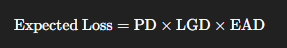

# 📊 Credit Risk Modeling: Estimating Expected Loss with LGD Prediction

This project implements a **two-stage Loss Given Default (LGD)** modeling pipeline as part of credit risk assessment. Using real-world loan data, we estimate the **expected loss** by building models to predict whether recovery occurs and how much is recovered. The implementation is done in **Python** using libraries like **scikit-learn**, **pandas**, **NumPy**, **Seaborn**, and **Matplotlib**.

---

## 📌 Project Highlights

- ✅ Real-world credit risk dataset (LendingClub loans 2007–2014)
- 📉 **Binary logistic regression** for classifying whether any recovery occurs
- 📈 **Linear regression** for predicting actual recovery rate (conditional)
- 📐 Custom classes for:
  - Logistic regression with p-values (using Fisher Information Matrix)
  - Linear regression with t-statistics and p-values
- 🔍 Exploratory data analysis and feature engineering
- 📁 Model persistence using `pickle`
- 🧪 Performance evaluation using metrics such as ROC-AUC, confusion matrix, and R²

---

## 🧠 Objective

To estimate **Expected Loss (EL)** using:

  
where:  
- **PD (Probability of Default)** – Likelihood that a borrower will default  
- **LGD (Loss Given Default)** – Percentage of exposure lost if default occurs  
- **EAD (Exposure at Default)** – Total value exposed to loss at the time of default

This notebook focuses on **LGD modeling** in two stages:
1. **Stage 1:** Classify if any recovery will happen (`recovery_rate > 0`)
2. **Stage 2:** Predict the recovery rate if recovery occurs

---

## 🗃️ Dataset

- **Source:** Lending Club (2007–2014)
- **Input:** Preprocessed CSV – `loan_data_2007_2014_preprocessed.csv`
- **Output:** Derived subset for defaults only (`Charged Off` loans)

---

## 🔧 Technologies Used

### 📚 Libraries
- `numpy` – numerical operations
- `pandas` – data handling
- `matplotlib`, `seaborn` – visualizations
- `sklearn` – machine learning models
- `scipy.stats` – statistical inference
- `pickle` – model serialization

### 🧠 Models
- **Stage 1: Binary Classification**
  - Custom `LogisticRegression_with_p_values` using Fisher Information Matrix
  - Metrics: Accuracy, Confusion Matrix, ROC-AUC
- **Stage 2: Regression**
  - Custom `LinearRegression` with t-statistics
  - Metrics: R² Score, Mean Squared Error

---

## 🧪 Workflow Overview

### ✅ Data Preparation
- Filtering charged-off loans
- Handling missing values (`mths_since_last_delinq`, `mths_since_last_record`)
- Deriving dependent variables:
  - `recovery_rate = recoveries / funded_amnt`
  - `CCF = (funded_amnt - total_rec_prncp) / funded_amnt`
- Clipping `recovery_rate` between 0 and 1

### 📊 Exploratory Data Analysis
- Histogram plots of `recovery_rate` and `CCF`

### 🧱 Feature Engineering
- One-hot encoded variables for:
  - `grade`, `home_ownership`, `verification_status`, `purpose`, `initial_list_status`
- Numerical variables: loan amount, interest rate, term, employment, credit history, income, etc.
- Removal of reference categories to avoid dummy variable trap

---

## 🚀 Stage 1: Logistic Regression

### Goal:
Classify if recovery is **0 or non-zero**

### Steps:
- Train-test split (80-20)
- Feature selection and dummy trap handling
- Custom logistic regression with p-values
- Evaluation:
  - Confusion Matrix
  - ROC-AUC Score
  - Visual ROC Curve

### Output:
- Saved model: `lgd_model_stage_1.sav`

---

## 🧮 Stage 2: Linear Regression

### Goal:
Predict **actual recovery rate** (when it's > 0)

### Steps:
- Filter `recovery_rate > 0` subset
- Train-test split (80-20)
- Linear regression with statistical inference (t-stats, p-values)
- Evaluation:
  - R² Score
  - Model coefficients with significance levels

---

## 💾 Model Persistence

Both models are saved using Python's `pickle` module for deployment or future reuse.
